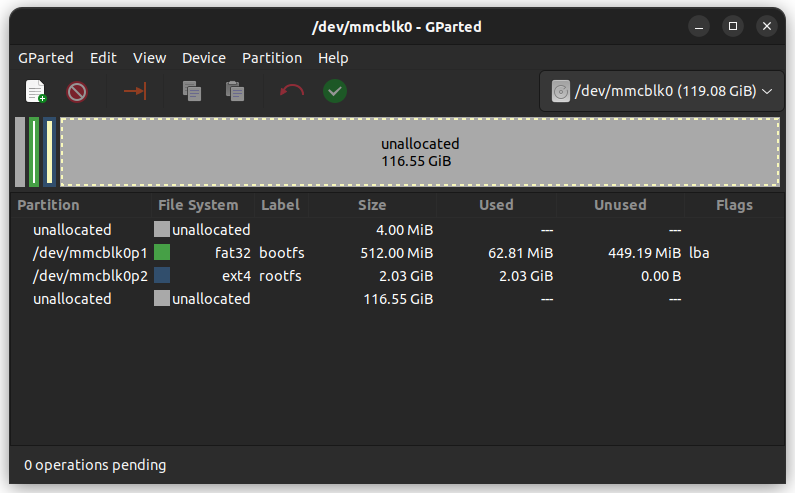
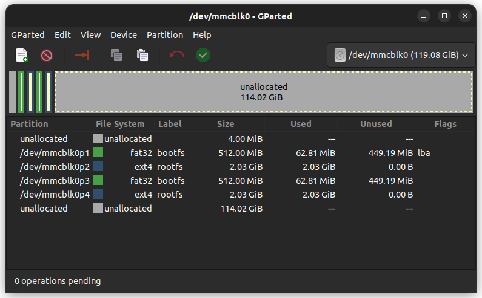

# How to remotely reflash a Raspberry Pi

When flashing an SD card with the Raspberry Pi Imager, it will create two partitions : `bootfs` and `rootfs`. We will make backups of these partitions on the SD card, so we can restore them when needed (so we will end up with 4 partitions instead of 2).

- Install an OS on your SD card with the [Raspberry Pi Imager](https://github.com/raspberrypi/rpi-imager). **Do not boot the Raspberry with the SD card yet!**

- Mount the `bootfs` partition. In the `cmdline.txt` file, change `root=PARTUUID=xxxxxxxx-02` to `root=PARTUUID=xxxxxxxx-04`. The idea here is that we'll use the partition 4 for the actual system root, and use partitions 2 and 3 as a backup that we'll restore to partitions 1 and 4 when resetting the system. We need to use the last partition as the filesystem root, because during first boot the root partition will be extended to span the whole free space, and it won't work if it isn't the last one.  
When done, unmount the partition.

- Mount the `rootfs` partition, and in `/etc/fstab`, change `PARTUUID=xxxxxxxx-02  /` to `PARTUUID=xxxxxxxx-04  /`.

- From the root of the `rootfs` partition, run `sudo sfdisk --disk-id /dev/mmcblk0 > etc/rpi-disk-id` (change `/dev/mmcblk0` to the SD card's block device).

- Download the `raspi-reset` script to `usr/local/sbin/` in the `rootfs` partition, and give it execute permission (`chmod +x raspi-reset`).  
When done unmount the `rootfs` partition.

From here, both partitions should be unmounted.

- Open the SD card with [GParted](https://gparted.org) or another partition editor. The partition schema should look like this:

- Copy the `bootfs` partition, by right-clicking on it, then paste it in the beginning of the free space on the right

- Do the same for the `rootfs` partition, and apply the changes. The resulting partition schema should look like this:

The partitions must be numbered in this order: partitions 1 and 2 should be the original bootfs and rootfs, partition 3 should be the cloned bootfs, and partition 4 the cloned rootfs.

---

Now, you can use the SD card with your Raspberry Pi. When you want to reset the system, just run `sudo raspi-reset`! It may be a good idea to run it inside a `screen` or `tmux` session, so in case your internet connection goes down during the process, your Raspberry Pi isn't left in an unusable state.
